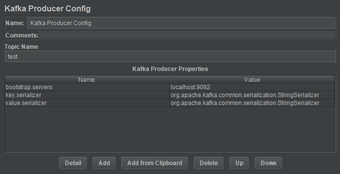
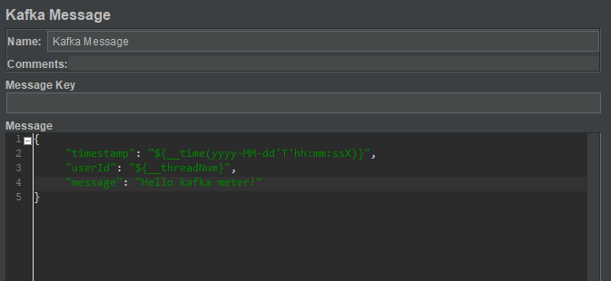
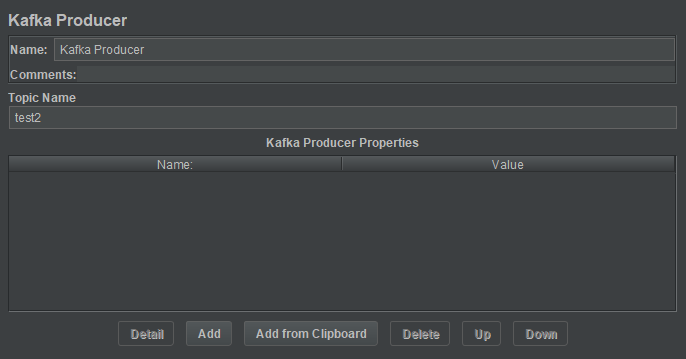

# Apache Kafka sampler for JMeter

A simple JMeter plugin that allows sends messages to Apache Kafka. 
Creates only one producer per thread (user) instead of creating and closing connection for every sample.

## Prerequisites

To run tests locally the following tools are required:

* Java 1.8+
* Maven
* JMeter 5
* Docker compose

## Components

This plugins provides a three JMeter components: `Kafka Producer Config`, `Kafka Message` and `Kafka Producer`.

### Kafka Producer Config

This component is responsible for configuring the default parameters for kafka producer.



### Kafka Message

This component is responsible for preparing a message for producer. 
You can use functions and variables from JMeter (https://jmeter.apache.org/usermanual/functions.html).



### Kafka Producer

This component is responsible for sending a message to kafka through producer. The topic name can also be overwritten here.



## Running locally

There is prepared the ``docker-compose.yaml`` file which allows you to run the following services:

* Kafka
* Zookeeper

To run all services, execute the following command:

```bash
docker-compose up -d
```

To crate JMeter's plugin, execute the following command:

```bash
mvn package
```

To install plugin in JMeter, copy the compiled java library to the JMeter's extensions catalog: ``${JMETER_HOME}\lib\ext``.

Now you can run tests from ``examples`` catalog, just import scenario to the JMeter by clicking ``File->Open`` and select desired scenario.
Finally, click run button.

## Configuration

TODO